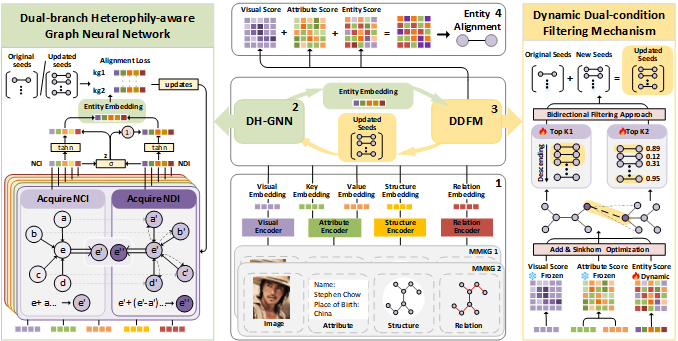

# DH-MEA

This repository contains the reviewer-facing implementation of **Dual-Branch Heterophily-Aware Graph Neural Network with Seed Iterative Optimization for Multimodal Entity Alignment**.



## Dependencies

The experiments were run with the following environment:

```text
python 3.10
torch 2.6.0+cpu
torch-scatter 2.1.2+pt26cpu
scipy 1.15.3
tqdm 4.67.1
numpy 2.2.3
```

Install the Python dependencies according to your local PyTorch/CUDA environment. In particular, `torch-scatter` should match the installed PyTorch version.

## Repository Structure

```text
src/
  main.py              # entry for DB15K-FB15K and YAGO15K-FB15K
  main_nv.py           # entry for OEA-style and DBP15K-style datasets
  att_em_ma.py         # attribute preprocessing for DB15K-FB15K/YAGO15K-FB15K
  vis_em_ma.py         # visual preprocessing for DB15K-FB15K/YAGO15K-FB15K
  att_em_ma_nv.py      # attribute preprocessing for OEA/DBP15K-style datasets
  vis_em_ma_nv.py      # visual preprocessing for OEA/DBP15K-style datasets
  model.py, model_nv.py, gcn_layer.py, data_loader.py, seed_iterate.py, sinkhorn.py

datasets/
  <dataset>/           # structural files and preprocessed modality files
image/
  framework.png
```

`main.py` and `main_nv.py` are two different training/evaluation entry points. Use `main.py` for `DB15K-FB15K` and `YAGO15K-FB15K`; use `main_nv.py` for `OEA_D_W_15K_V1`, `OEA_D_W_15K_V2`, `OEA_EN_DE_15K_V1`, `OEA_EN_FR_15K_V1`, `fr_en`, `ja_en`, and `zh_en`.

## Datasets

The code supports the following datasets:

- **MMKG:** `DB15K-FB15K`, `YAGO15K-FB15K`
- **Multi-OpenEA:** `OEA_EN_FR_15K_V1`, `OEA_EN_DE_15K_V1`, `OEA_D_W_15K_V1`, `OEA_D_W_15K_V2`
- **DBP15K:** `zh_en`, `ja_en`, `fr_en`

The repository includes the structural split files used by the scripts. Additional raw visual features and the SentenceTransformer model for attribute encoding should be placed locally before running preprocessing. The visual resources are available [here](https://pan.quark.cn/s/9c929a93683e), and the attribute encoder is available [here](https://pan.quark.cn/s/8efa5d7b9b50).

The attribute encoder directory must be named `model_att` and placed at the repository root:

```text
model_att/
  config.json
  pytorch_model.bin
  tokenizer.json
  ...
```

## Preprocessing: Required File Names

The training scripts expect precomputed entity embeddings under `datasets/<dataset>/Emb/` and side-modality similarity matrices under `datasets/<dataset>/Score Matrix/`. The directory name `Score Matrix` contains a space and should be kept exactly as written.

### DB15K-FB15K and YAGO15K-FB15K

Use this branch of preprocessing for `DB15K-FB15K` and `YAGO15K-FB15K`.

Required input files:

```text
datasets/<dataset>/
  ent_ids_1
  ent_ids_2
  triples_1
  triples_2
  attr

datasets/Vis/
  db15k.npy      # image embeddings for DB15K
  db15k          # entity-to-image mapping for DB15K
  fb15k.npy      # image embeddings for FB15K
  fb15k          # entity-to-image mapping for FB15K
  yago15k.npy    # image embeddings for YAGO15K
  yago15k        # entity-to-image mapping for YAGO15K
```

Generated files:

```text
datasets/<dataset>/Emb/
  key_embedding.npy
  value_embedding.npy
  vis_embedding.npy

datasets/<dataset>/Score Matrix/
  Attr.npy
  Vis.npy
```

Example for `DB15K-FB15K`:

```bash
mkdir -p "datasets/DB15K-FB15K/Emb" "datasets/DB15K-FB15K/Score Matrix"
python src/att_em_ma.py --dataset DB15K-FB15K
python src/vis_em_ma.py --dataset DB15K-FB15K --max_image_num 6
```

Example for `YAGO15K-FB15K`:

```bash
mkdir -p "datasets/YAGO15K-FB15K/Emb" "datasets/YAGO15K-FB15K/Score Matrix"
python src/att_em_ma.py --dataset YAGO15K-FB15K
python src/vis_em_ma.py --dataset YAGO15K-FB15K --max_image_num 6
```

Then run training/evaluation with:

```bash
python src/main.py --dataset DB15K-FB15K --epoch 100
python src/main.py --dataset YAGO15K-FB15K --epoch 100
```

### OEA-Style and DBP15K-Style Datasets

Use this branch of preprocessing for `OEA_D_W_15K_V1`, `OEA_D_W_15K_V2`, `OEA_EN_DE_15K_V1`, `OEA_EN_FR_15K_V1`, `fr_en`, `ja_en`, and `zh_en`.

Required input files:

```text
datasets/<dataset>/
  ent_ids_1
  ent_ids_2
  triples_1
  triples_2
  training_attrs_1
  training_attrs_2

datasets/Vis/
  <dataset>.pkl   # e.g., OEA_D_W_15K_V1.pkl, OEA_D_W_15K_V2.pkl, fr_en.pkl
```

Generated files:

```text
datasets/<dataset>/Emb/
  attr_embedding.npy
  vis_embedding.npy

datasets/<dataset>/Score Matrix/
  Attr.npy
  Vis.npy
```

Example for `OEA_D_W_15K_V1`:

```bash
mkdir -p "datasets/OEA_D_W_15K_V1/Emb" "datasets/OEA_D_W_15K_V1/Score Matrix"
python src/att_em_ma_nv.py --dataset OEA_D_W_15K_V1
python src/vis_em_ma_nv.py --dataset OEA_D_W_15K_V1
```

Example for `zh_en`:

```bash
mkdir -p "datasets/zh_en/Emb" "datasets/zh_en/Score Matrix"
python src/att_em_ma_nv.py --dataset zh_en
python src/vis_em_ma_nv.py --dataset zh_en
```

Then run training/evaluation with:

```bash
python src/main_nv.py --dataset OEA_D_W_15K_V1 --epoch 100
python src/main_nv.py --dataset OEA_D_W_15K_V2 --epoch 100
python src/main_nv.py --dataset zh_en --epoch 100
```

## Quick Reproduction Workflow

For each dataset, follow the same three-step workflow:

```text
1. Place the structural files in datasets/<dataset>/.
2. Generate or place the modality files in datasets/<dataset>/Emb/ and datasets/<dataset>/Score Matrix/.
3. Run the corresponding training script: src/main.py or src/main_nv.py.
```

If `Emb/` and `Score Matrix/` already contain the required `.npy` files, the preprocessing step can be skipped and the training script can be run directly.

## Output

Training saves the best checkpoint under `src/model_params.pth` by default and prints validation/test metrics to the console. The default epoch setting is `100` for both `main.py` and `main_nv.py`; this value can be overridden with `--epoch`. Here, `--epoch` denotes the maximum number of training epochs. The seed scheduling horizon is controlled separately in `seed_iterate.py` by `total_epochs=40`.
